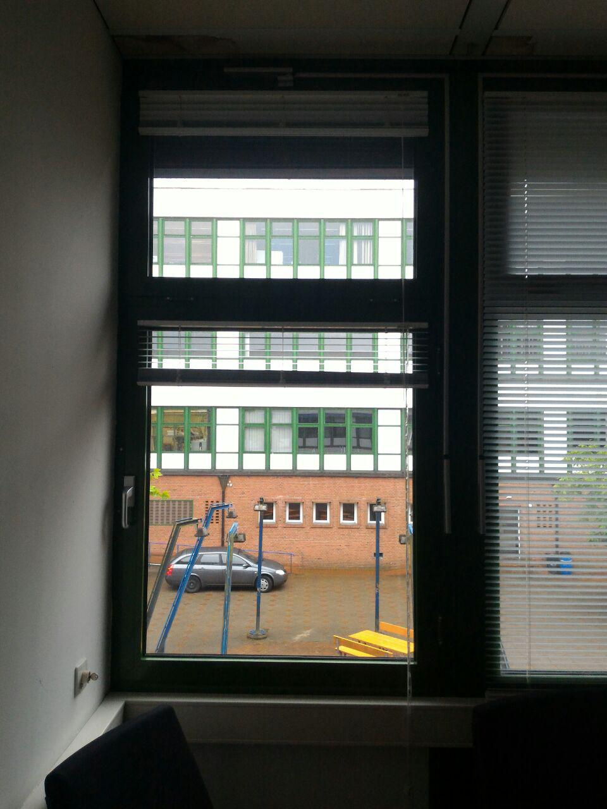
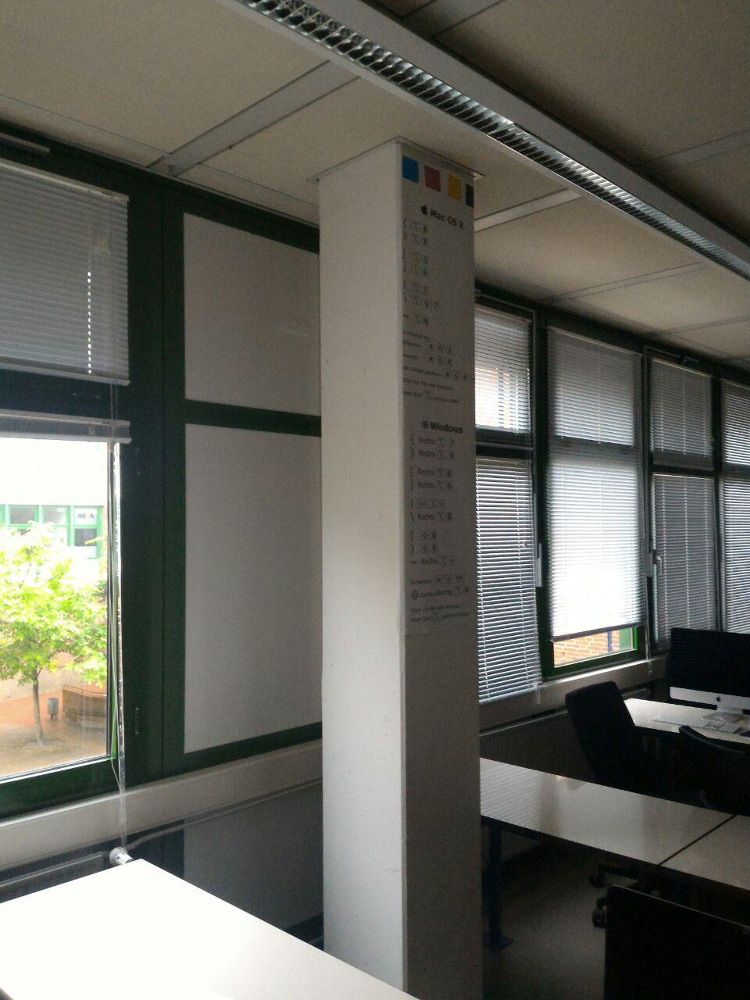
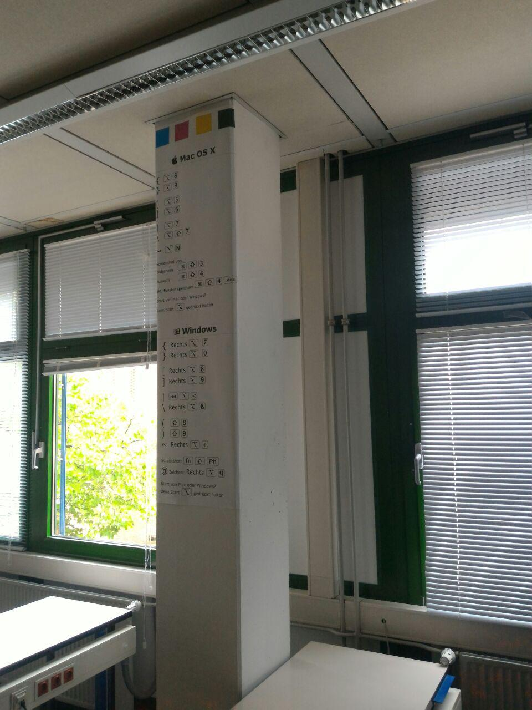
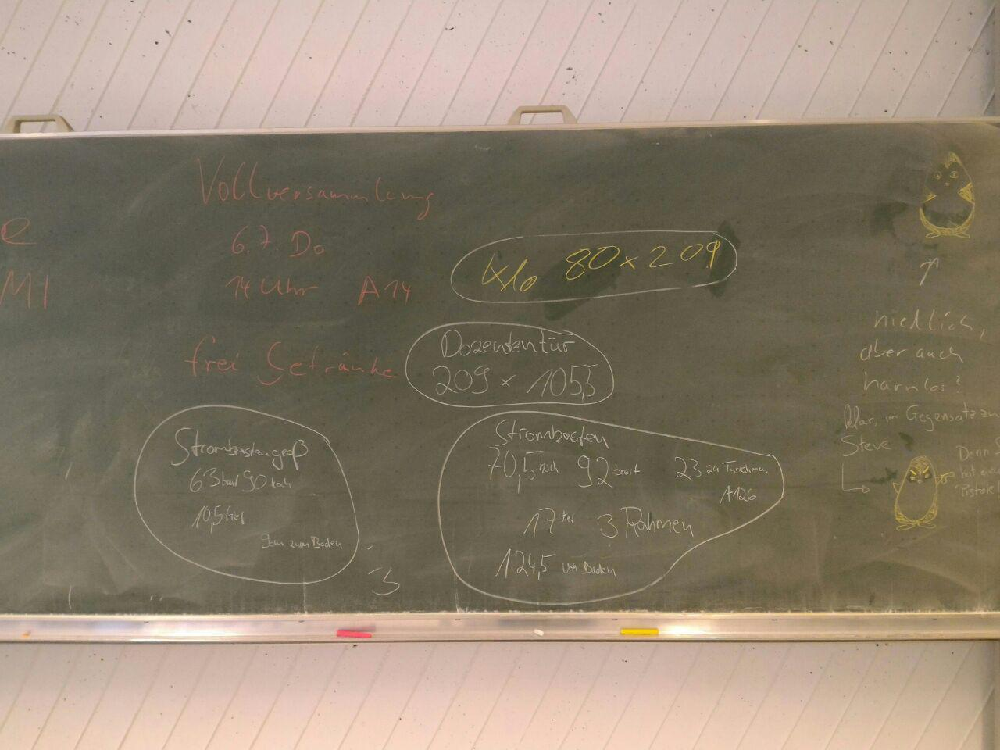

# AGEB
Dino VS Machine
## Abmessungen

Raum:
8305mm breit
2995mm hoch
100082mm lang

Säule:
400mm breit und tief
2995mm hoch

Türblatt:
2115mm hoch
1105mm breit
40mm tief

Rahmen:
2130mm hoch
2255mm breit
120mm tief
45mm dick

AussenMassRahmen: 1215mm hoch 1020mm breit
Rahmendicke: 65mm

oberer rahmen: 720mm hoch 1020mm

Abstand der Rahmen zueinander: 38mm von unten nach oben

945mm ab boden

110mm Säule breit

Innenkante Scheibe bis mitte

Fußleisten 45x20mm

deckenpanele: 1070mm quadratisch 100mm leiste 10mm spalt

Waschbecken Clivia top

15mm Säulen bevel

945mm ab boden

110mm Säule breit

Innenkante Scheibe bis mitte

Fußleisten 45x20mm

deckenpanele: 1070mm quadratisch 100mm leiste 10mm spalt

Waschbecken Clivia top

15mm Säulen bevel

Tafel: 4000mm x 1070mm
Rahmenbreite: 11,5mm

2,20m von dem blauen Dings aus

Blauer Kasten 85cm von Oberkante Fenster

